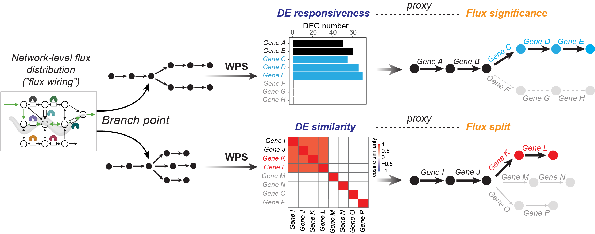
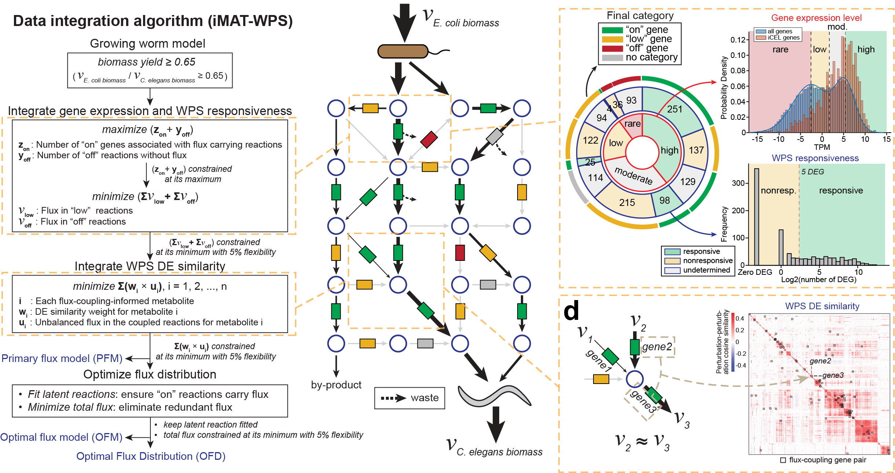

# iMAT-WPS
The iMAT-WPS algorithm that integrates gene expression, WPS responsiveness and WPS perturbation-perturbation similarity to predict systems-level flux wiring.

## Introduction 
iMAT-WPS is a data integration algorithm that comprehensively integrate the entire metabolic gene WPS dataset with _C. elegans_ metabolic network model to predict systems-level flux distribution in the wild-type (unperturbed) animal. iMAT-WPS is adapted from our previous **iMAT++** algorithm in [MERGE](https://github.com/WalhoutLab/MERGE) package with substantial extension to enable integrations of WPS responsiveness and perturbation-perturbation simularity. This produces a triple integration of three information about each metabolic gene: how much it expresses (gene expression levels), whether it has an transcriptional response when perturbed (WPS responsiveness) and whether its transcriptional response is similar to that of any other genes (WPS perturbation-perturbation similarity). The integration of the latter two is based on two fundamental hypotheses as illutrated in the following figure: 

In our study, we first experimentally estabolished proof-of-concept of these two novel hypotheses by case studies and isotope tracing. Then we developed iMAT-WPS algorithm to systematically use these hypotheses to integrate WPS data with metabolic network model for flux prediction. The iMAT-WPS algorithm can be summarized in the figure below:

For further reading about iMAT-WPS and insights it reveals on flux wiring in _C. elegans_, please refer to our paper: 
[Title and authors](https://bioRxiv_link)

_Please note that the main purpose of this repository is to provide source codes to reproduce the study. However, iMAT-WPS is also a standalone algorithm that allows application to other similar datasets. Due to the complexity of integrating large-scale dataset like WPS data, we did not make toy-dataset-based walkthrough of the algorithm. Rather, even application is desired, we recommend users following the steps for reproducing our results while replacing input data and interactively develop your pipelines. It remains important to follow the steps to preprocess and filter the data before running main integration function._

## Dependencies 
iMAT-WPS was developed and tested in MATLAB R2022b. [COnstraint-Based Reconstruction and Analysis (The COBRA Toolbox)](https://opencobra.github.io/cobratoolbox/stable/) is required to perform the analysis. Check [here](https://opencobra.github.io/cobratoolbox/stable/installation.html) for the installation guidance of COBRA Toolbox. The programs were tested for COBRA Toolbox - 2023 version, but should be compatible with an earlier version. This repository also contains a few R script for data visualization. 

The Linear Program (LP) and Mixed-Integer Linear Problem (MILP) solver used in the study was [gurobi](http://gurobi.com) 10.0.1. The built-in solver interface of COBRA Toolbox was used, so that we expect our program to also work with other supported solver in COBRA Toolbox. Please [see here](https://opencobra.github.io/cobratoolbox/stable/installation.html#solver-installation) for furter information about solver availability. 

## Content 
To reproduce the iMAT-WPS integration of metabolic gene WPS dataset, run the scripts in the root directory following the numeric order in the prefix of the file name (also the order listed below). The scripts and folders are described as follows:

### Step 1: Preprocessing of WPS data to generate inputs for integration
* __a1_analyze_responsiveness_constraints.m__: This script interactively analzyes the gene expression levels in WT controls of WPS dataset as well as the WPS responsiveness. This includes statistical modeling, data inspections and visualizations, followed by producing the ready-to-use inputs for running iMAT-WPS integration.
* __a1_analyze_DEsimilarity_constraints.m__: This includes the code to interactively analyze the perturbation-perturbation similarities of WPS dataset, starting with the cosine similarity matrix. It involves several filtering, table inspection and plotting to produce the ready-to-use inputs for running iMAT-WPS integration. It also includes sanity checks to make sure perturbation-perturbation data is consistent with hypothesis assumptions.
* __(optional) a1_make_labeled_DEsim_heatmap.R__ and __a1_make_stacked_pie_chart.R__: R scripts to make __Fig. 2c, d__ (e.g., the labeled panel '__c, d__' in the above figure).

### Step 2: Run iMAT-WPS integration 
* __a2_1_run_integrations.m__: a master script to run different types of integrations, including the iMAT-WPS triple integration or dual integrations that only integrates two of the tree inputs. It also contains only integrating expression levels (i.e., iMAT++) and no integration control.
  * Notice: this script is only a wrapper script for easy running of the programs. The actual integration pipelines are in [integration_pipelines](integration_pipelines) folder, which calls the main integration function [IMATplusplus_wiring_triple_inetgration_final](scripts/IMATplusplus_wiring_triple_inetgration_final.m). If you want to apply iMAT-WPS for a custom dataset, please edit corresponding integration pipeline in [integration_pipelines](integration_pipelines).
* __a2_2_run_FVA.m__: iMAT-WPS involves not only the prediction of an Optimal Flux Distribution (OFD) (i.e., in __a2_1_run_integrations.m__), but also a prediction confidence analysis based on Flux Variability Analysis (FVA). This script performs FVA using the MILP model produced in __a2_1_run_integrations.m__.
* __a2_3_compare_diff_integrations.m__: a wrapper function to conveniently generate a summary table of OFD, FVA intervals, whether a reaction is bounded, and these values across different integrations.
* __a2_4_prediction_mechanism_analysis.m__: Analyzing the prediction mechanism (which data drives which flux prediction) by Leave-One-Out (LOO) and Leave-One-In (LOI) analysis.
  * Notice: although this script contains the codes to perform LOO and LOI on a local machine (a laptop or desktop), systematic LOO and LOI analysis is computationally expansive, due to the recursive excecution of iMAT-WPS and its FVA. We performed the analysis in a computational cluster using wrapper codes in [cluster_codes_for_mechanisms](cluster_codes_for_mechanisms) folder. These cluster scripts can be usable in a cluster based on LSF scheduler. Unfortunately, we cannot develop a more generally applicable function for other clusters.
* __(optional) a2_make_euler_plot.R__: R script to make __Extended Data Fig. 3a, b__.

### Step 3: post-integration analysis
* __a3_responsiveness_randomization_nonrespRxn_flux.m__: randomization analysis to determine whether the fitting of resonsiveness data is significantly self-consistent. Related to __Fig. 3e,f__.
* __a3_DE_similarity_randomization_metFitLoss.m__: randomization analysis to determine whether the fitting of real perturbation-perturbation similarity data is significantly less conflicting with the fitting of responsiveness and expression levels. Related to __Fig. 3g__.
* __a4_case_study_PPP_cycle_screen_for_causal_genes.m__, __a4_case_study_PPP_cycle_responsiveness_mechanism.m__, __a4_case_study_PPP_cycle_interaction_with_similarity.m__: scripts to perform the case study of the prediction mechanism of cyclic PPP. Related to __Fig. 4b-e__.
* __a4_case_study_PPshunt_msa.m__: scripts to perform the case study of the flux solution space of propionate shunt. Related to the confidence level of flux related to msa in __Fig. 4a__.
* __a4_figure_making_assist.m__: the helper function to interactively determine the arrow width and confidence level of all fluxes visualized in __Fig. 4a__. The arrow width produced in this script was use to first draw the flux distribution cartoon in a U.S. letter page in Illustrator. This script is provided for reproducibility purpose.
* __a4_study_a_case.m__: outdated script and will be removed in the next update. 

### Folders
* __input__: inputs for iMAT-WPS analysis including the metabolic network model and WPS data. 
* __output__: pre-stored outputs of modeling results. Used for making the figures in the paper.
* __figures__: raw figures used for making the paper. These figures were the input for final figure making in Illustrator.
* __scripts__: functions involved in iMAT-WPS. It may contain unused function(s) for historical reason. 
* __cluster_codes_for_mechanisms__: codes to run LOO and LOI analysis in a computation cluster with LSF scheduler system.
  

We tried our best to ensure the codes are well commented and readable. However, if you encounter any questions, please feel free to reach out (see below for __Contacts__)! We are particularly interested in assisting anyone who wants to apply and test iMAT-WPS in other systems!

## Contact

Any questions or suggestions on reproducing iMAT-WPS analysis or testing it in other systems/datasets are welcomed! Please contact Xuhang Li [xuhang.li@umassmed.edu](mailto:xuhang.li@umassmed.edu) for questions!

